# Progress Update
# Learning 1: Using ExperimentGrid to test multiple parameters and using spinup.utils.plot to plot data
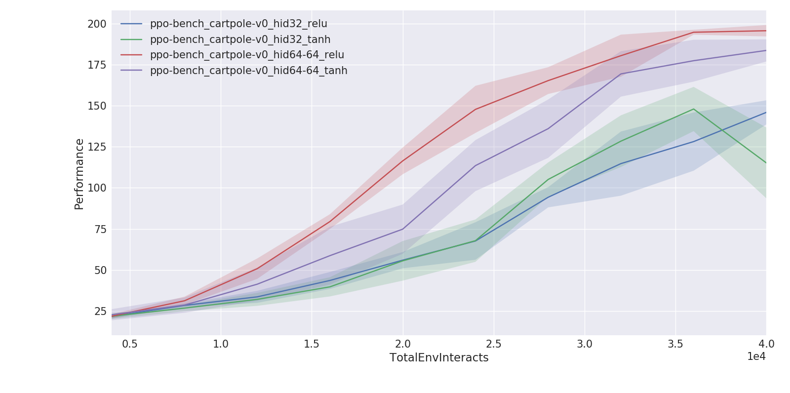

# Learning 2: Mountain Car
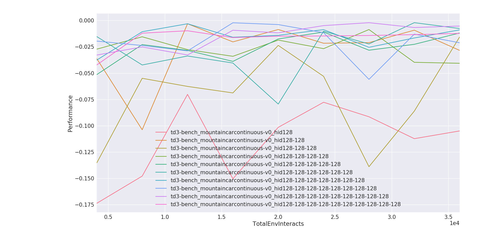
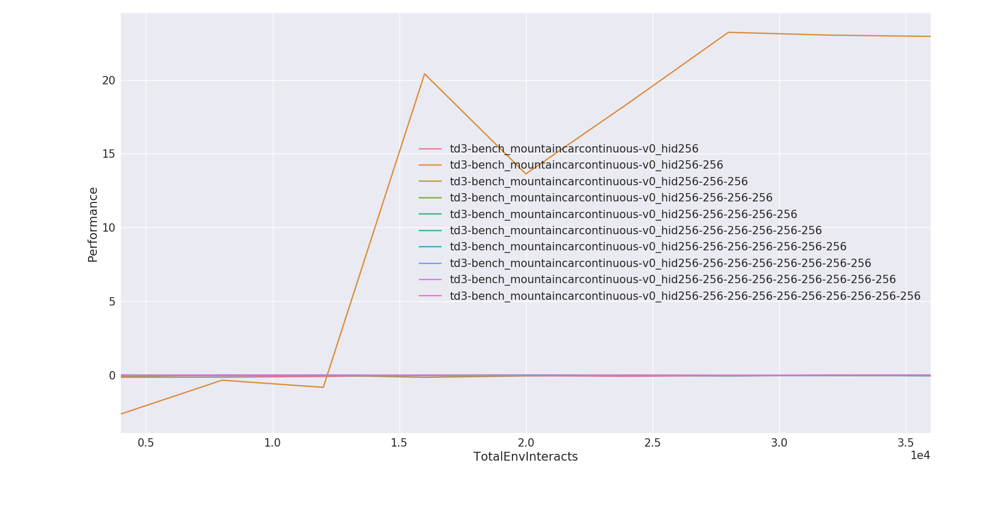

From the graphics above, we can see that a 2-layer actor-critic network with 256 nodes in each layer works very well

# Learning 3: Algorithm Performance Comparison on Mountain Car Continuous
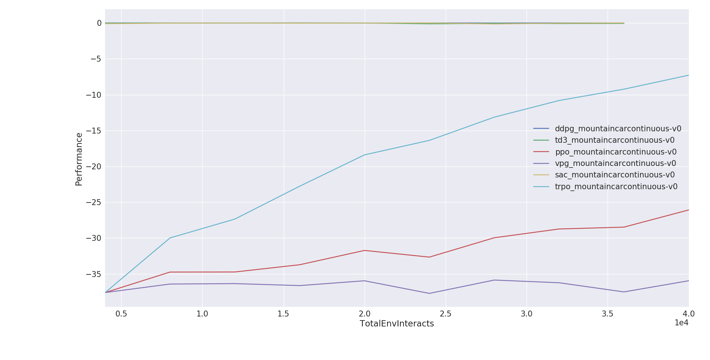
We see that trpo works very very well here. Q-learning algorithms did not perform as well (ddpg, td3, and sac), perhaps number of epochs were too few?
I think maybe the code that spits compares performance to EnvInteracts cant do it when you compare policy gradient algos to q-learning algos

# Learning 4: Does seed matter?
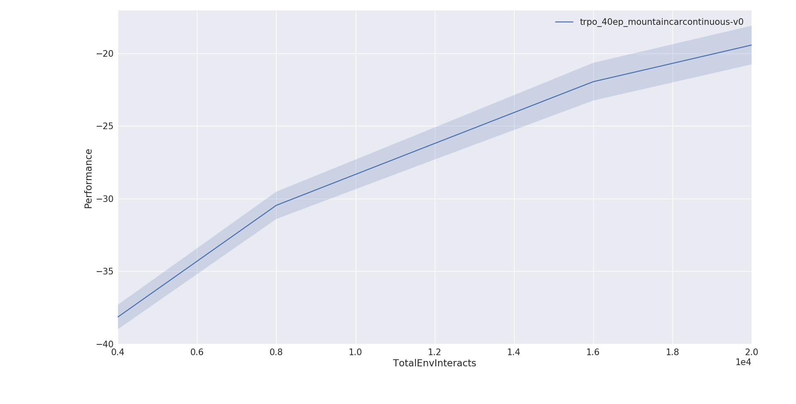
For this problem, variance in training performance as a function of seed is not that high. We should always check to see if training is highly dependent on seed first before running a long training

But for more complex problems seed does cause performance to vary a bit, but algo is still able to converge on a solution as we do more epochs regardless of seed. What would be bad is if certain seeds cause algo to not converge on an optimal policy.
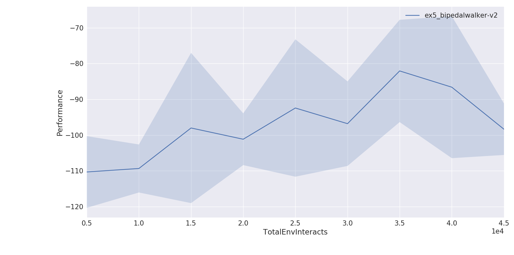

# Learning 5: Number of epochs
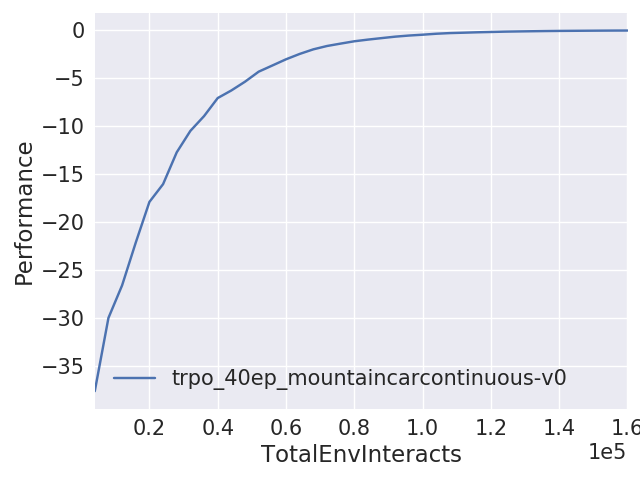
I ran 40 epochs for trpo here. We can see that after about 30 epochs the gains from additional training flatlines.

# Learning 6: What do the variables mean?
## Example:
```Python
---------------------------------------
|             Epoch |               2 |
|      AverageEpRet |            -8.9 |
|          StdEpRet |            13.5 |
|          MaxEpRet |          -0.907 |
|          MinEpRet |           -32.9 |
|  AverageTestEpRet |          -0.189 |
|      StdTestEpRet |          0.0167 |
|      MaxTestEpRet |          -0.154 |
|      MinTestEpRet |          -0.207 |
|             EpLen |             999 |
|         TestEpLen |             999 |
| TotalEnvInteracts |         1.6e+04 |
|     AverageQ1Vals |          -0.124 |
|         StdQ1Vals |          0.0319 |
|         MaxQ1Vals |         -0.0646 |
|         MinQ1Vals |          -0.239 |
|     AverageQ2Vals |          -0.124 |
|         StdQ2Vals |          0.0319 |
|         MaxQ2Vals |         -0.0643 |
|         MinQ2Vals |          -0.238 |
|            LossPi |          0.0964 |
|             LossQ |        7.62e-05 |
|              Time |            51.2 |
---------------------------------------
```
## Discussion on more confusing variables:
EpLen
    - EpLen is obtained by ep_len in the td3 algo.
    - ep_len is constrained by max_ep_len (int): Maximum length of trajectory / episode / rollout.
    - For td3, would be useful to tweak max_ep_len maybe

## Action Limit?
- Concern: Action_space is distributed between [0, 2]
- But ReLu function only goes to [0, 2]
- Solution: DDPG clips the action to act_limit which they get from env.action_space.high[0]
- Note that lower bound is clipped that way as well

# Learning 7: How to learn about hyperparameters of algorithm?
- Running tests with ExperimentGrid takes a lot of computation power and time. It's useful to have heuristics about what would work for a given problem to converge on a solution quicker
- Exercises I can do to improve my understanding about how to tweak hyperparameters for algorithms can be done by trying to make all algorithms work for every problem. For example, getting VPG to work on BipedalWalker-V2.

# Learning 8: How ExperimentGrid works
ExperimentGrid is a class that has a method called run. When you use 'run' you pass it a 'thunk' which is the DRL algo you want to use.

The DRL algos can be modified at the epoch loop to end training when ep_ret > some value. Save all your parameters, then do a break.

# Learning 9: Why use SavedModel instead of tf.Train.Saver?
```
Though there have been many solutions, most of them is based on tf.train.Saver. When we load a .ckpt saved by Saver, we have to either redefine the tensorflow network or use some weird and hard-remembered name, e.g. 'placehold_0:0','dense/Adam/Weight:0'. Here I recommend to use tf.saved_model, one simplest example given below, you can learn more from Serving a TensorFlow Model
```
How to save/restore a model: https://stackoverflow.com/questions/33759623/tensorflow-how-to-save-restore-a-model/47235448#47235448
Why SavedModel: https://stackoverflow.com/questions/46513923/tensorflow-how-and-why-to-use-savedmodel?rq=1

# Learning 10: Using tf.Train.Saver
Loading the computation graph from the .pb file format and retraining the weights is difficult because AdamOptimizer has to create new variables to train the model. Those variables clash with the ones that already exist in the computation graph that you saved. So the best way I've found right now is to use tf.train.saver to save checkpoints of the computation graph and retrain from there.

## Difficulty: Outputting the checkpoint files
At first I tried to get the output_dir from logx.py but later on I realized that the output_dir is obtained from ExperimentGrid, which is from run_utils.py. This makes sense: the folder names generated are from the experiment names given the ExperimentGrid. If you look at the "main" part of ddpg.py, setup_logger_kwargs outputs the output_dir as a dictionary. You can use the key to retrive output_dir in the ddpg function itself

# Methodology: Training the agent
## Step 1: Testing for algo with best performance (Optional)

## Step 2: Testing for best starting seed
Plot results and check if model is robust (does seed matter?)
If training performance variance is high, look for seed that is good
```Python
from spinup.utils.run_utils import ExperimentGrid
from spinup import td3
import tensorflow as tf

if __name__ == '__main__':
    import argparse
    parser = argparse.ArgumentParser()
    parser.add_argument('--cpu', type=str, default='auto')
    parser.add_argument('--num_runs', type=int, default=4)
    args = parser.parse_args()    

    eg = ExperimentGrid(name='trpo_40ep')
    eg.add('env_name', 'MountainCarContinuous-v0', '', True)
    eg.add('seed', [10*i for i in range(args.num_runs)])
    eg.add('epochs', 5)
    eg.add('steps_per_epoch', 4000)
    eg.add('ac_kwargs:activation', [tf.nn.relu], '')
    eg.run(td3, num_cpu=args.cpu)
```

## Step 3: Training the agent
```Python

```

## Current problems and issues
1. After training an agent, how do I continue training the agent?
    - Can I load the agent, train it, then save it under a different file name?

# Methodology: Testing the agent
There are two ways to run the agent.
1. Use spinningup's pre-built utilities (which runs the agent until 'done' flag)
	- This allows you to also see how the agent learns because it goes through all the different epochs

2. Use own code to sample actions from agent policy
	- This skips directly to showing how well the final policy performs in the environment as well as going beyond the 'done' flag

## Method 1
```Python
modelpath = "data/ppo-bench_cartpole-v0_hid64-64_relu/ppo-bench_cartpole-v0_hid64-64_relu_s20"
len = 0
episodes = 100
norender = False
#itr = -1
itr = 'last'

#Only for soft-actor critic
deterministic = False


# This part is unecessary because load_policy already restores tf_graph
#model = spinup.utils.logx.restore_tf_graph(sess, modelpath)


env, get_action = load_policy(modelpath, 
                                itr if itr >=0 else 'last',
                              deterministic)

run_policy(env, get_action, len, episodes, not(norender))
```

## Method 2
```Python
modelpath = "data/ppo-bench_cartpole-v0_hid64-64_relu/ppo-bench_cartpole-v0_hid64-64_relu_s20"
len = 0
episodes = 100
norender = False
itr = -1

#Only for soft-actor critic
deterministic = False

env, get_action = load_policy(modelpath, 
                                itr if itr >=0 else 'last',
                              deterministic)


for i_episode in range(episodes):
    observation = env.reset()
    
    while(True): #for t in range(100):
        env.render()
        #print(observation)
        #action = env.action_space.sample()
        action = get_action(observation)

        #env.step returns these 4 variables
        observation, reward, done, info = env.step(action)
        '''
        if done:
            print("Environment finished after {} timesteps".format(t+1))
            break
        '''
env.close()
```

# Hyperparameter and Algo Testing Results on Environments
# MountainCar Continuous
## Algo Comparison
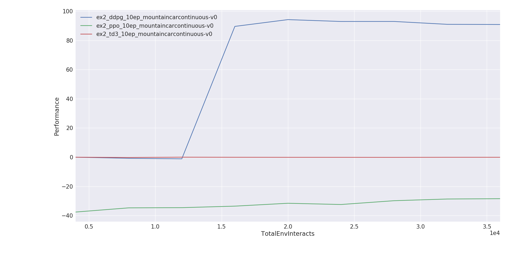

From the graph above, we see that DDPG actually works really really well. I'm surprised TD3 didn't work as well compared to DDPG

## Seed Test
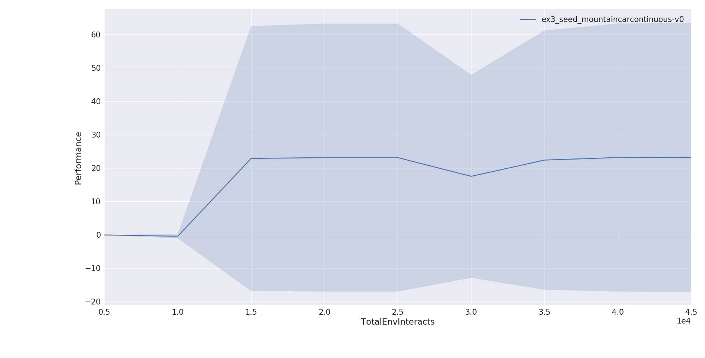

I ran a seed test and it seems the seed you start with really affects whether the model converges or not. Variance is quite large.


# Pendulum-v0
## Algo Comparison
Results were quite bad at first. 10 epochs still no sign of converging.
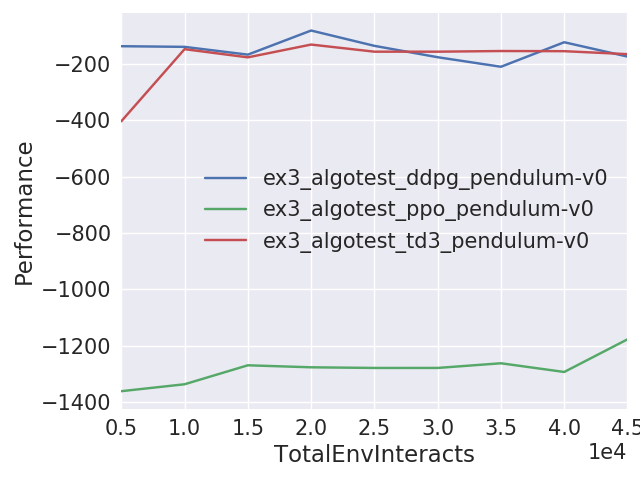

## Seed Test
I ran a seed test and it seems the seed you start with affects how it starts, but later on it doesn't matter as much.
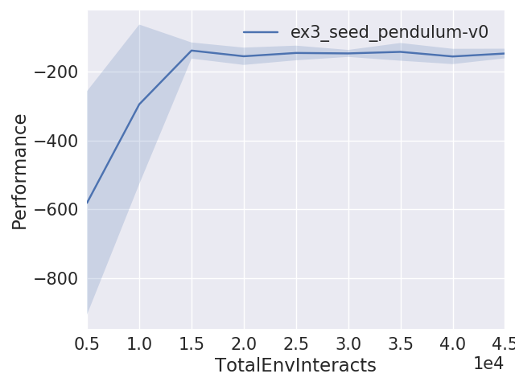

## Layers Test
Adding more layers doesn't seem to help with convergence. 32 nodes seem to be equally as good as 64 nodes.
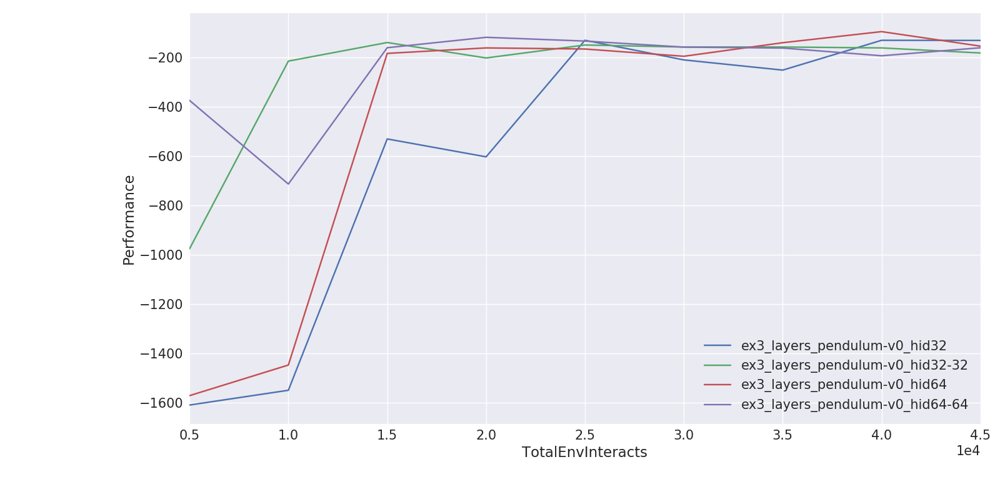

## Working model
I ran DDPG and it flatlined at -200 average expected returns. Average expected returns was negative but for some reason model works when you test it out (although policy is clearly not optimal, takes a few tries before it gets it)
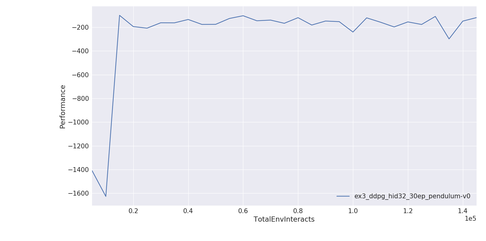

# Acrobot-v1
## Algo Comparison
TRPO works exceedingly well here
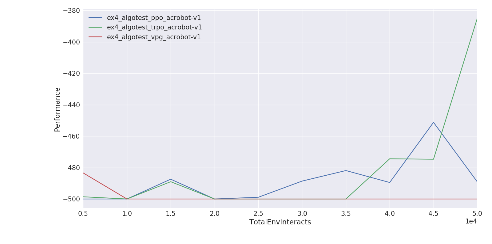

# BipedalWalker-v2
## Seed Test
Starting seed seems to be important for more complex problems like BipedalWalker.


## Layers Test
A few things I noticed:
1. The fewer nodes you have, the more jumpy the signal gets. Performance jumps up and down a lot when you have few nodes
    - More nodes = more smooth increase in performance
2. Actor-Critic network with more layers tend to start off with lower performance
    - Not necessarily true, but what I've noticed here

## 100 Epochs
Model is not converging well.
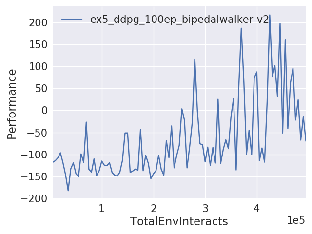

## Training Overnight
Model doesn't converge at an optimal policy even after running it overnight with DDPG:
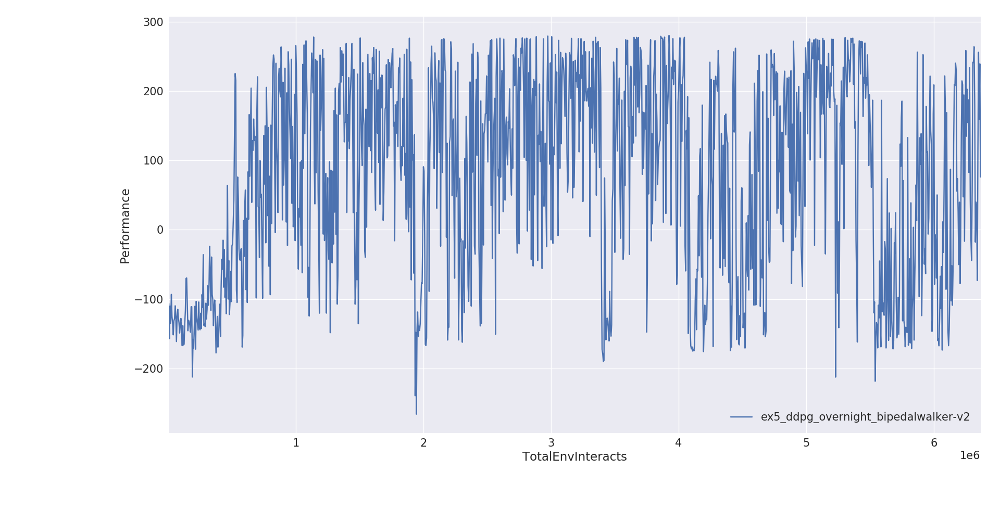


# Useful Tweaks: Algo
# TD3
## max_ep_len
- would be useful to tweak to allow your algo to explore more
- It's possible that max_ep_len is too short, thus preventing the algo from reaching its goal

## save_freq (int)
- How often (in terms of gap between epochs) to save the current policy and value function.

## start_steps
- Number of steps for uniform-random action selection, before running real policy. Helps exploration.
- default number is 10 000, which seems pretty good